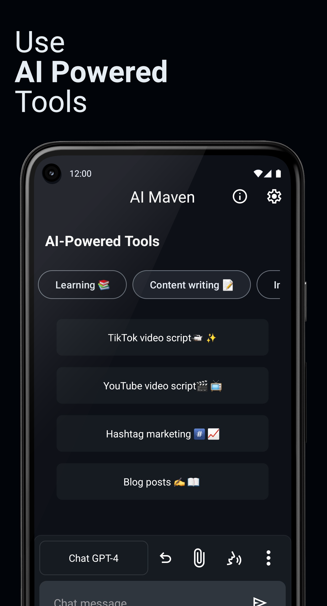

# AI Maven

AI Maven is an AI-powered Android application with over 1,700+ users and 5,500+ conversations, delivering personalized chat experiences in real time. The app integrates with a scalable, serverless backend hosted entirely on AWS.

## App Screenshot

  

For more screenshots, see our Play Store listing: `play.google.com / store / apps / details?id=store.dynamicapps.aimaven`

---

## Architecture Overview

When users interact with the Android app, requests are routed through **AWS API Gateway**, which directs traffic to either:

- **Lambda Functions** – for lightweight, serverless operations (e.g., retrieving chat history, user subscription info)
- **Auto-Scaling EC2 Instances** – for long-running compute tasks via a load balancer, managed by a Flask application and Celery queue

---

## AWS Stack

- **API Gateway**: Routes requests to individual Lambda endpoints or compute backend
- **Lambda Functions**: Stateless serverless compute for tasks such as:
  - Authentication (`Authorizer-dev.py`)
  - Chat/thread management (`getThread.py`, `deleteThread.py`)
  - File uploads (`postFileUpload.py`, `getS3PostPresignedURL.py`)
  - User/account management (`getUserId.py`, `deleteAccount.py`)
- **S3**: Storage for chat data and uploaded media
- **DynamoDB**: Fast-access NoSQL database for chat history, user metadata
- **EC2 + Load Balancer**: Auto-scaling compute layer for heavier workloads (e.g., vision/image processing)
- **Lambda Layers**:
  - `google-api-python-client`
  - `google-auth`
  - `httpx`
  - `dateutil`

---

## Backend Services

- **Framework**: Flask, with Gunicorn for WSGI hosting
- **Asynchronous Processing**: Celery + Redis for task queues
- **Logging & Monitoring**: Custom logging via `gunicorn_logging_conf.py`

**Key backend scripts**:
- `rest_server.py` – Entry point for Flask app
- `server.py` – Flask route definitions
- `image_stream.py`, `images.py` – Image handling logic
- `token_count.py` – Token usage tracking
- `celery_auto_reload.sh` – Utility script for Celery restarts

---

